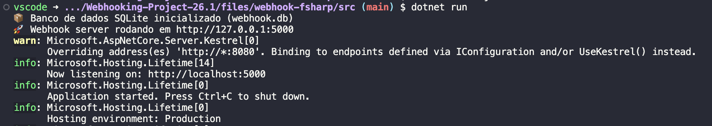
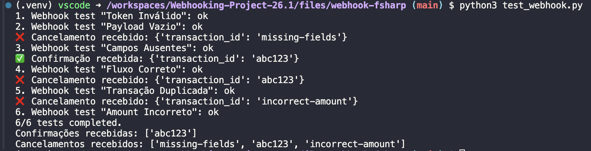

# Webhook de Pagamento — Programação Funcional (F#)

Implementação de um serviço HTTP que recebe webhooks de um gateway de pagamento, valida os dados recebidos e confirma ou cancela a transação conforme apropriado. Desenvolvido em **F#** com **Giraffe** (web framework funcional sobre ASP.NET Core), seguindo princípios de programação funcional: funções puras, imutabilidade, composição via `Result.bind` e isolamento explícito de efeitos colaterais.

**Projeto implementado com ajuda de IA generativa, no entanto tudo foi testado e validado, assim como a estrutura proposta**

---

## Sumário

- [Arquitetura](#-arquitetura)
- [Requisitos](#-requisitos)
- [Como instalar e rodar](#-como-instalar-e-rodar)
- [Como testar](#-como-testar)
- [Estrutura do projeto](#-estrutura-do-projeto)
- [Itens opcionais implementados](#-itens-opcionais-implementados)
- [Endpoints](#-endpoints)

---

## Arquitetura

O fluxo do webhook segue um **pipeline funcional** onde cada validação é uma função pura que recebe um input e retorna `Result<Success, ValidationError>`. As validações são compostas via `Result.bind`, e o pipeline curto-circuita assim que qualquer etapa falha:

```
┌─────────────────────────────────────────────────────────────┐
│  POST /webhook                                              │
│       │                                                     │
│       ▼                                                     │
│  ┌────────────────────────────────────────────────┐         │
│  │  validateToken                                 │         │
│  │       │ Ok                                     │         │
│  │       ▼                                        │         │
│  │  parsePayload                                  │         │
│  │       │ Ok                                     │         │
│  │       ▼                                        │         │
│  │  extractTransactionId                          │         │
│  │       │ Ok                                     │         │
│  │       ▼                                        │         │
│  │  validateRequiredFields                        │         │
│  │       │ Ok                                     │         │
│  │       ▼                                        │         │
│  │  validateNotDuplicate    (consulta SQLite)     │         │
│  │       │ Ok                                     │         │
│  │       ▼                                        │         │
│  │  validateAmount                                │         │
│  │       │ Ok                                     │         │
│  │       ▼                                        │         │
│  │  validateSignature       (HMAC opcional)       │         │
│  │       │ Ok                                     │         │
│  │       ▼                                        │         │
│  │  Confirma + persiste no SQLite + 200 OK        │         │
│  └────────────────────────────────────────────────┘         │
│       │ Error em qualquer etapa                             │
│       ▼                                                     │
│  Cancela (se aplicável) + persiste + 4xx                    │
└─────────────────────────────────────────────────────────────┘
```

Os efeitos colaterais (HTTP requests para o gateway, escrita no SQLite) ficam isolados em módulos específicos (`Gateway.fs`, `Database.fs`), enquanto a lógica de validação (`Validation.fs`) é composta inteiramente por funções puras.

---

## Requisitos

- **.NET SDK 8.0** ou superior 
- **Python 3.8+** (apenas para rodar os testes)
- **OpenSSL** (apenas se quiser gerar certificado HTTPS)

Verifique a instalação:
```bash
dotnet --version    # deve mostrar 8.x.x ou superior
python3 --version
```

---

## Como instalar e rodar

### 1. Clone o repositório
```bash
git clone <url-do-repo>
cd webhook-fsharp
```

### 2. Restaure as dependências
```bash
cd src
dotnet restore
```

### 3. Rode o servidor (HTTP)
```bash
dotnet run
```

O servidor estará disponível em `http://127.0.0.1:5000`.

### 4. (Opcional) Rode com HTTPS

Gere primeiro o certificado auto-assinado:
```bash
cd ../certs
./generate-cert.sh
cd ../src
```

Depois rode com a flag `--https`:
```bash
dotnet run -- --https
```

HTTPS estará em `https://127.0.0.1:5443` (mantendo HTTP em `5000` por compatibilidade com os testes).

---

## Como testar

### 1. Instale as dependências Python
```bash
pip install -r requirements.txt
```

### 2. Em um terminal, rode o servidor F#
```bash
cd src
dotnet run
```



### 3. Em outro terminal, rode os testes
```bash
python3 test_webhook.py
```



### Saída esperada (todos os 6 testes passando):
```
1. Webhook test "Token Inválido": ok
2. Webhook test "Payload Vazio": ok
3. Webhook test "Campos Ausentes": ok
4. Webhook test "Fluxo Correto": ok
5. Webhook test "Transação Duplicada": ok
6. Webhook test "Amount Incorreto": ok
6/6 tests completed.
```

> **Importante:** entre execuções dos testes, apague o arquivo `webhook.db` para resetar o estado (ou o teste "Fluxo Correto" falhará por já existir uma transação `abc123` confirmada de uma execução anterior).
> ```bash
> rm src/webhook.db
> ```

---

## Estrutura do projeto

```
webhook-fsharp/
├── src/
│   ├── Domain.fs          # Tipos do domínio (Discriminated Unions)
│   ├── Database.fs        # Persistência SQLite (efeito colateral isolado)
│   ├── Validation.fs      # Funções puras de validação + HMAC
│   ├── Gateway.fs         # Chamadas HTTP para gateway (efeito isolado)
│   ├── Handlers.fs        # Pipeline funcional + handler do endpoint
│   ├── Program.fs         # Entry point e configuração do Kestrel
│   └── Webhook.fsproj     # Definição do projeto e dependências
├── certs/
│   └── generate-cert.sh   # Script para gerar certificado SSL
├── test_webhook.py        # Testes oficiais da disciplina
├── requirements.txt       # Dependências Python (para testes)
├── .gitignore
└── README.md
```

A ordem dos arquivos `.fs` no `.fsproj` importa: F# compila top-down, então `Domain` vem antes de `Validation`, e assim por diante.

---

## Itens opcionais implementados

Todos os 6 itens opcionais da rubrica estão implementados:

| # | Item opcional | Onde está |
|---|---------------|-----------|
| 1 | **Verificar integridade do payload** | `Validation.fs` → `validateSignature` (HMAC-SHA256 via header `X-Signature`) |
| 2 | **Veracidade da transação** | `Validation.fs` → `validateToken` (Bearer token) + `validateAmount` (valor/moeda esperados) |
| 3 | **Cancelar transação em divergência** | `Gateway.fs` → `cancelTransaction` chamado em `Handlers.fs` para erros que carregam `txId` |
| 4 | **Confirmar transação em sucesso** | `Gateway.fs` → `confirmTransaction` chamado quando o pipeline retorna `Ok` |
| 5 | **Persistir transação em BD** | `Database.fs` → SQLite com tabela `transactions` (idempotência usa o BD como fonte da verdade) |
| 6 | **Implementar HTTPS** | `Program.fs` → Kestrel configurado para HTTPS na porta 5443 com certificado em `certs/webhook.pfx` (flag `--https`) |

### Sobre o HMAC (item 1)
A validação de assinatura HMAC é **opcional por design**: se o header `X-Signature` não estiver presente, a validação é pulada para manter compatibilidade com o `test_webhook.py` oficial (que não envia assinatura). Em produção, este header seria obrigatório.

Para testar a assinatura manualmente:
```bash
BODY='{"event":"payment_success","transaction_id":"abc123","amount":"49.90","currency":"BRL","timestamp":"2025-05-11T16:00:00Z"}'
SIG=$(echo -n "$BODY" | openssl dgst -sha256 -hmac "hmac-shared-secret-key" | awk '{print $2}')

curl -X POST http://127.0.0.1:5000/webhook \
  -H "Content-Type: application/json" \
  -H "X-Webhook-Token: meu-token-secreto" \
  -H "X-Signature: $SIG" \
  -d "$BODY"
```

---

## Endpoints

### `POST /webhook`
Recebe notificações do gateway de pagamento.

**Headers:**
- `Content-Type: application/json` (obrigatório)
- `X-Webhook-Token: meu-token-secreto` (obrigatório)
- `X-Signature: <hmac>` (opcional — integridade HMAC-SHA256)

**Body:**
```json
{
  "event": "payment_success",
  "transaction_id": "abc123",
  "amount": "49.90",
  "currency": "BRL",
  "timestamp": "2025-05-11T16:00:00Z"
}
```

**Respostas:**

| Cenário | Status | Body |
|---------|--------|------|
| Sucesso | `200` | `{"status":"confirmed","transaction_id":"abc123"}` |
| Token inválido | `403` | `{"status":"cancelled","reason":"invalid token"}` |
| Payload inválido | `400` | `{"status":"cancelled","reason":"invalid payload"}` |
| Campo ausente | `400` | `{"status":"cancelled","transaction_id":"...","reason":"missing field: <campo>"}` |
| Transação duplicada | `400` | `{"status":"cancelled","transaction_id":"...","reason":"transaction duplicated"}` |
| Valor divergente | `400` | `{"status":"cancelled","transaction_id":"...","reason":"mismatch"}` |
| Assinatura inválida | `400` | `{"status":"cancelled","transaction_id":"...","reason":"invalid signature"}` |

### `GET /health`
Healthcheck simples.

```json
{"status":"ok"}
```
